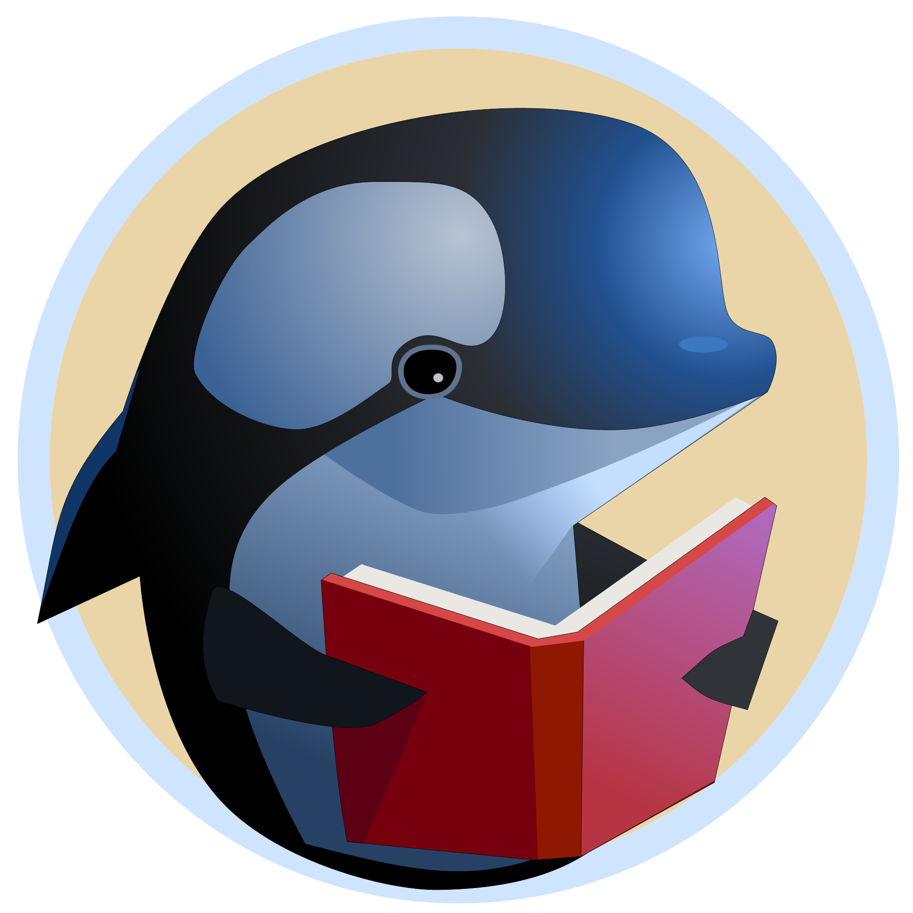

# ORCA


[](https://deps.rs/repo/github/kolja/orca?path=%2F)
[](https://opensource.org/licenses/MIT)
[](https://coveralls.io/github/kolja/orca?branch=main)
A simple OPDS Server for Calibre written in Rust

## Configuration

If you point the environment variable `ORCA_CONFIG` to a `.toml` file, that's where the configuration will be read from. Otherwise, it will look for a file named `orca.toml` or `orca/config.toml` in `$HOME/.config/`.

The server will either start as HTTP or HTTPS server depending on the value of 'protocol'. If you set it to 'https', you have to provide a path to a certificate and a key file.
```toml
[server]
ip = "<your_ip>"
port = 8080
protocol = "https" # or "http"
cert = "/path/to/cert.pem"
key = "/path/to/key.pem"

[authentication]
alice = "468a286ae97d67f84b56:94Gxd6BCmgkBAtMEIxjW"
bob = "9a8692aeabe66ebfa609:iK4ODmrJ6RsD8CYRjcY6"

[calibre.libraries]
library = "/Volumes/library"
nonfiction = "/Volumes/nonfiction"
```

## Authentication

The server supports basic authentication: You can generate a password hash like so:
```bash
orca --hash <login>:<password> # e.g. orca --hash alice:secretpassword
```
The server will print the hash which you have to copy to the `[authentication]` section of your config file.

## Development

There are a couple of tasks you can run with `cargo make`:

- `cargo make docker-build <image/name>` - Build Docker image and push it to the registry
- `cargo make git-tag` - Create and push a new git tag. The Version number is read from `Cargo.toml`

## License

MIT
